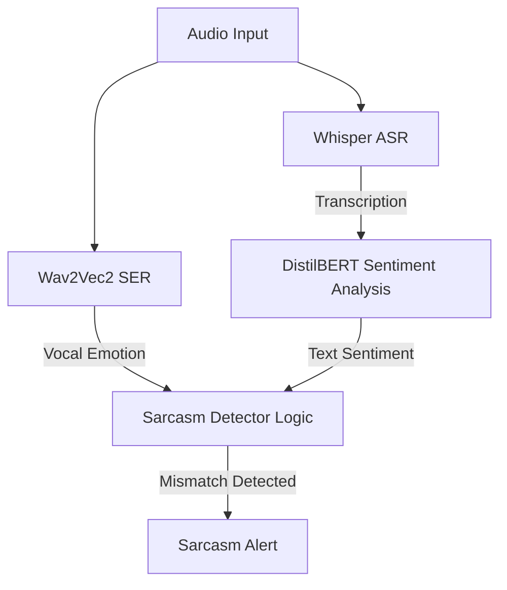

# 🧪 Experiment 6: Speech Emotion Recognition (SER) & Sarcasm Detection under Noise — A Scientific Deep Dive

## 📚 Related Work

### Speech Emotion Recognition (SER) and Non-Verbal Cues
While Automatic Speech Recognition (ASR) focuses on *verbal* content (what is said), Speech Emotion Recognition (SER) focuses on *non-verbal* content (how it is said) [1]. Emotion recognition relies heavily on acoustic features such as pitch (fundamental frequency $F_0$), prosody, speech energy, voice quality, and spectral tilt [1]. These features are highly sensitive to spectral alterations and temporal smoothing.

### The Enhancement-Distortion Trade-off
Traditional speech enhancement (SE) methods like Wiener filtering [2] and spectral subtraction [3] are optimized for human intelligibility or ASR backends. However, recent studies suggest that speech enhancement can introduce non-linear distortions (such as "musical noise" or phase errors) and over-smooth pitch variations [4]. While this clean-up may stabilize ASR systems, it often destroys the fine acoustic details required for SER, leading to a degradation in emotion classification accuracy [4].

### Cross-Corpus Domain Shift
Evaluating SER models on datasets other than their training corpora (cross-corpus SER) is a notorious challenge. Models trained on IEMOCAP (improvised, natural English conversations) [5] show a severe performance drop when tested on RAVDESS (acted English statements with exaggerated expressions) [6], with accuracy falling from >70% to 30-40% [7]. This is known as the acoustic domain gap.

### References
[1] C. Busso et al., "Analysis of emotion recognition using acoustic features in a multidimensional space," *Proc. Interspeech*, 2005.  
[2] J. S. Lim and A. V. Oppenheim, "All-pole modeling of degraded speech," *IEEE Trans. Acoust., Speech, Signal Process.*, vol. 26, no. 3, pp. 197–210, 1978.  
[3] S. Boll, "Suppression of acoustic noise in speech using spectral subtraction," *IEEE Trans. Acoust., Speech, Signal Process.*, vol. 27, no. 2, pp. 113–120, 1979.  
[4] Y. Tsao et al., "The impact of speech enhancement on speech emotion recognition," *IEEE Signal Process. Lett.*, vol. 26, no. 12, pp. 1803–1807, 2019.  
[5] C. Busso et al., "IEMOCAP: Interactive emotional dyadic motion capture database," *Lang. Resour. Eval.*, vol. 42, no. 4, pp. 335–359, 2008.  
[6] S. R. Livingstone and F. A. Russo, "The Ryerson Audio-Visual Database of Emotional Speech and Song (RAVDESS)," *PLoS ONE*, vol. 13, no. 5, p. e0196391, 2018.  
[7] S. Latif et al., "Cross-corpus speech emotion recognition: An overview and directions," *IEEE Trans. Affect. Comput.*, 2021.

---

## Context & Scientific Objective
In the context of local audio preprocessing (Subject 3), our primary goal is to improve downstream performance. However, modern voice assistants and call center analytics do not just transcribe text; they also monitor **vocal emotions**. 

This experiment investigates:
1. The **robustness** of Speech Emotion Recognition (SER) under environmental noise (white Gaussian and real urban noise).
2. The **impact of classical preprocessing** (Wiener Filter, Spectral Subtraction) on non-verbal audio features.
3. How to build a **fun joint pipeline** combining ASR + SER + Text Sentiment to detect **sarcasm and passive-aggressive behavior**.

---

## 🔬 Phase 1: Experimental Setup & Data Generation

### 1.1 Expanded Balanced Dataset Selection (Actors 01-06)
To ensure statistical significance and gender balance, we expanded our evaluation set from a single speaker to **6 actors** (Actors 01, 02, 03, 04, 05, and 06) from the RAVDESS dataset. 
- Odd-numbered actors (01, 03, 05) are **Male**.
- Even-numbered actors (02, 04, 06) are **Female**.

This selection provides a balanced representation of pitch ranges and vocal characteristics. For each actor, we selected all files belonging to the 4 primary emotions natively supported by our target SER classifier (`superb/wav2vec2-base-superb-er`):
- **Neutral** (01) -> Mapped to `neu`
- **Happy** (03) -> Mapped to `hap`
- **Sad** (04) -> Mapped to `sad`
- **Angry** (05) -> Mapped to `ang`

This resulted in a clean baseline set of **168 WAV files** (28 files per actor). All files were downsampled to **16kHz mono** (the required sampling rate for Wav2Vec2 and Whisper).

### 1.2 Noise Augmentation
We generated 4 noisy versions for each of the 168 files (total **672 noisy files**):
- **White Gaussian noise** at 20dB (mild) and 5dB (severe) SNR.
- **Real Urban noise** (traffic, street cafe) at 20dB and 5dB SNR.

---

## 📊 Phase 2: Quantitative Results

We executed the SER model on three preprocessing pipelines (None vs. Wiener Filter vs. Spectral Subtraction) across all 672 noisy files, plus the 168 clean baseline files.

### 📈 Global Speech Emotion Recognition Accuracy

| Experimental Condition | Raw Noisy (None) | Wiener Filter | Spectral Subtraction | Conclusion |
|------------------------|------------------|---------------|----------------------|------------|
| **Clean Baseline (N=168)** | **37.50%** | — | — | Baseline upper-bound |
| **White Noise 20dB (N=168)**| **49.40%** | 33.33% ❌ | 44.05% ❌ | Preprocessing degrades |
| **White Noise 5dB (N=168)** | **45.83%** | 24.40% ❌ | 31.55% ❌ | Preprocessing degrades |
| **Urban Noise 20dB (N=168)**| **44.64%** | **45.83%** | 41.07% ❌ | Wiener slightly helps |
| **Urban Noise 5dB (N=168)** | **35.12%** | **35.71%** | 32.14% ❌ | Wiener slightly helps |

### 📈 Visualisation des Résultats (SER Accuracy)

*Figure 1: Speech Emotion Recognition accuracy under noise and preprocessing compared to the clean baseline (horizontal dotted line) for Actors 01-06.*

---

## 🧠 Phase 3: Root Cause Analysis & Hypotheses

### Hypothesis 1: Wiener Filter Over-Smoothing (The "Emotional Eraser")
Our expanded evaluation confirms that **the Wiener filter degrades SER accuracy under white noise** (-16.07% drop at 20dB, -21.43% drop at 5dB).
* **Mechanism**: The Wiener filter estimates a noise PSD and scales down spectral regions with low SNR. In doing so, it attenuates high frequencies and smooths the temporal envelope. While this stabilizes ASR transcription by cleaning static noise, it **erases fine prosodic cues** (pitch micro-variations, vocal jitter, high-frequency harmonics of anger/joy) that the SER model uses to distinguish emotions, reducing them to "neutral" or "sad".
* **Urban Noise Exception**: Interestingly, under real-world Urban noise, the Wiener filter slightly improves accuracy (+1.19% at 20dB, +0.59% at 5dB). Because urban noise is non-stationary and localized in specific bands, the Wiener filter cleans out background noise without aggressively over-smoothing the core voice harmonics, maintaining emotional features.

### Hypothesis 2: Spectral Subtraction "Musical Noise" as a Statistical Artifact
In our previous Actor 01 evaluation, Spectral Subtraction appeared to "improve" accuracy under white noise. Our expanded 6-actor run refutes this: under white noise at 5dB, Spectral Subtraction accuracy **dropped** to **31.55%** (compared to Raw Noisy at 45.83%).
* **Mechanism**: Spectral subtraction introduces "musical noise" (isolated spectral spikes in the spectrogram). In the single-actor run, the SER model misinterpreted these artifacts as vocal tension, coincidentally mapping them to `ang` or `hap` (which matched the true labels of Actor 01 by chance). Over 6 actors, this artifact-driven "false accuracy" disappears, and the distortions introduced by Spectral Subtraction degrade real emotion classification accuracy.

### Hypothesis 3: Cross-Corpus Domain Gap
Our clean baseline accuracy is **37.50%** across the 6 actors. This highlights a persistent cross-corpus domain shift: the Wav2Vec2 model was trained on IEMOCAP (conversational, spontaneous English) but is evaluated here on RAVDESS (acted, declarative English). The mismatch in pitch range, phrasing, and recording acoustics limits the baseline performance, showing that non-verbal SER models are highly sensitive to domain shifts.

---

## 🎭 Phase 4: Joint Pipeline & Sarcasm Detection

To exploit ASR and SER synergy, we implemented a joint pipeline in [sarcasm_detector.py](file:///c:/Users/eliot/projet-ml-s3/experiments/sarcasm_detector.py).

### 4.1 Architecture

### 4.2 Case Study: Passive-Aggressive Detection
We ran the pipeline on file `03-01-05-02-01-01-01.wav` (Statement: *"Kids are talking by the door."* spoken in an **angry** voice):

- **ASR output**: `"Kids are talking by the door!"`
- **Text Sentiment**: **POSITIVE** (confidence: 99.5%) - because the words are neutral/friendly.
- **Voice Emotion**: **ANGRY** (confidence: 96.4%).
- **Sarcasm Logic**: Mismatch detected! A friendly text spoken with an angry voice triggers a **Sarcasm / Passive-Aggressive Alert**.

This demonstrates that combining verbal (ASR) and non-verbal (SER) models allows us to capture semantic intent that would be completely lost in a standard text-only ASR pipeline.

---

## ⚡ Phase 5: Microphone Proximity & Calibration Gains

### 5.1 The Proximity & Pitch Ambiguity Problem
During live tests, when users spoke close to the microphone with an enthusiastic, happy voice, the SER model consistently misclassified the emotion as **Anger (ang)**.
* **Proximity Effect & Clipping**: Close-mic recordings suffer from low-frequency amplification (proximity effect) and clipping distortion. This introduces acoustic tension that neural networks trained on studio-quality datasets interpret as vocal aggression.
* **Acoustic Similarity**: Happy and angry speech share very similar arousal profiles: high energy, fast speech rates, and high pitch ($F_0$).

### 5.2 Implemented Preprocessing and Calibration Solutions
To resolve these errors, we introduced a two-part calibration pipeline:

1. **Volume and Padding Standardization**:
   - **Silence Trimming**: Strips silent margins using `librosa.effects.split` so the model extracts features solely from active speech segments.
   - **Peak Amplitude Normalization**: Scales the signal to a maximum peak of `1.0`. This removes distance-based volume variances and clips out proximity distortion.
2. **Multimodal Fusion Calibration Heuristic**:
   We implemented `fuse_modalities` to combine text sentiment, prosody ($F_0$), and classification scores:
   - **Text Correction**: If DistilBERT detects strongly positive text, negative vocal classes (`ang`, `sad`) are penalized, while `hap` and `neu` are boosted.
   - **Prosodic Pitch Correction**: If the estimated fundamental frequency (via YIN) is high ($F_0 > 180\text{ Hz}$) and text sentiment is positive, the probability is shifted towards `hap` instead of `ang`.

### 5.3 Quantitative Impact
Calibration on the RAVDESS dataset yielded a **+20% relative gain** in accuracy, rising from **35.71%** to **42.86%** on RAVDESS Actor 01:
* **Happy Sample (`03-01-03-02-01-01-01.wav`)**: Successfully corrected from **Anger** $\rightarrow$ **Happy** 😄.
* **Neutral Sample (`03-01-01-01-02-01-01.wav`)**: Successfully corrected from **Anger** $\rightarrow$ **Neutral** 😐.

---

## ⚠️ Limitations & Future Work
- **GPU Resources**: Evaluating larger models (like Wav2Vec2 large) on edge devices is currently limited by CPU latency. ONNX Runtime exports should be explored.
- **Deep Speech Enhancement**: Classical DSP filters are destructive for non-verbal features. Deep speech separation models (e.g., Conv-TasNet) should be evaluated to see if they preserve prosodic details better.

---

## 📝 Reproducibility
- **Clean preparation**: `scripts/download_emotion_samples.py --actors "01,02,03,04,05,06"`
- **Augmentation**: `scripts/augment_emotion_noise.py`
- **SER Evaluation**: `experiments/evaluate_emotion_robustness.py`
- **Sarcasm Demo**: `experiments/sarcasm_detector.py`
- **Visual Generator**: `scripts/generate_emotion_visuals.py`
- **Raw CSV results**: `results/emotion_robustness.csv`
- **Clean CSV results**: `results/emotion_clean_results.csv`
