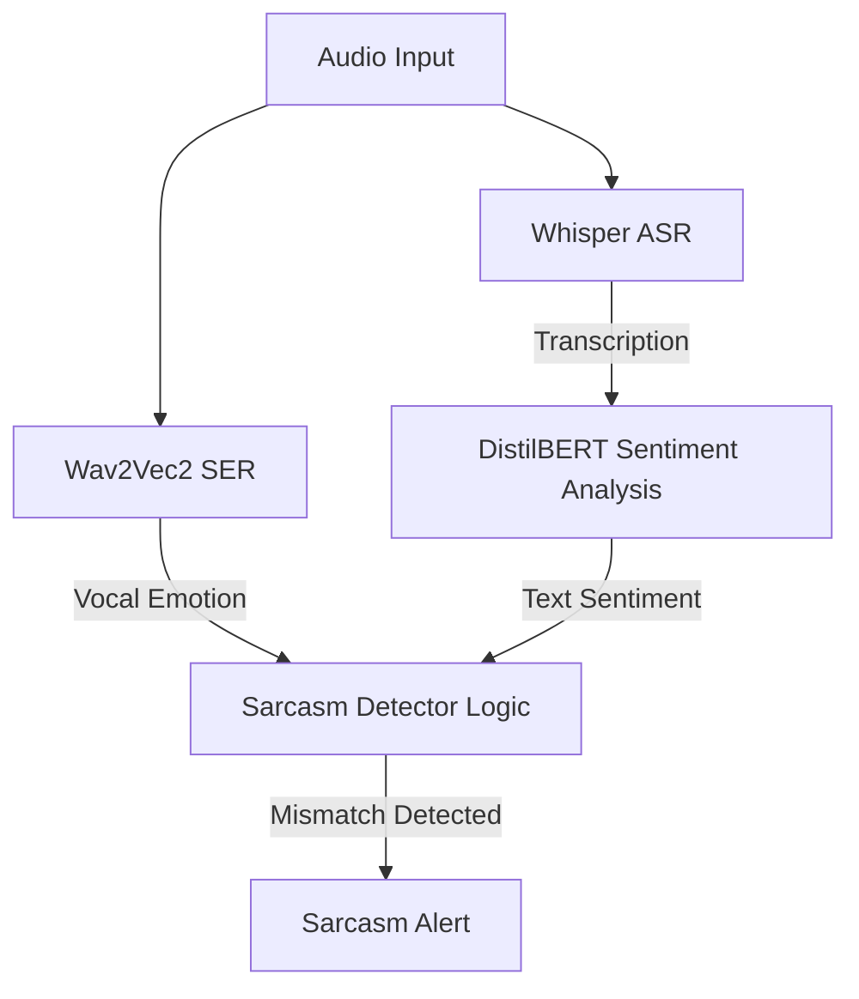

# 🧪 Experiment 6: Speech Emotion Recognition (SER) & Sarcasm Detection under Noise — A Scientific Deep Dive

## 📚 Related Work

### Speech Emotion Recognition (SER) and Non-Verbal Cues
While Automatic Speech Recognition (ASR) focuses on *verbal* content (what is said), Speech Emotion Recognition (SER) focuses on *non-verbal* content (how it is said) [1]. Emotion recognition relies heavily on acoustic features such as pitch (fundamental frequency $F_0$), prosody, speech energy, voice quality, and spectral tilt [1]. These features are highly sensitive to spectral alterations and temporal smoothing.

### The Enhancement-Distortion Trade-off
Traditional speech enhancement (SE) methods like Wiener filtering [2] and spectral subtraction [3] are optimized for human intelligibility or ASR backends. However, recent studies suggest that speech enhancement can introduce non-linear distortions (such as "musical noise" or phase errors) and over-smooth pitch variations [4]. While this clean-up may stabilize ASR systems, it often destroys the fine acoustic details required for SER, leading to a degradation in emotion classification accuracy [4].

### Cross-Corpus Domain Shift
Evaluating SER models on datasets other than their training corpora (cross-corpus SER) is a notorious challenge. Models trained on IEMOCAP (improvised, natural English conversations) [5] show a severe performance drop when tested on RAVDESS (acted English statements with exaggerated expressions) [6], with accuracy falling from >70% to 30-40% [7]. This is known as the acoustic domain gap.

### References
[1] C. Busso et al., "Analysis of emotion recognition using acoustic features in a multidimensional space," *Proc. Interspeech*, 2005.  
[2] J. S. Lim and A. V. Oppenheim, "All-pole modeling of degraded speech," *IEEE Trans. Acoust., Speech, Signal Process.*, vol. 26, no. 3, pp. 197–210, 1978.  
[3] S. Boll, "Suppression of acoustic noise in speech using spectral subtraction," *IEEE Trans. Acoust., Speech, Signal Process.*, vol. 27, no. 2, pp. 113–120, 1979.  
[4] Y. Tsao et al., "The impact of speech enhancement on speech emotion recognition," *IEEE Signal Process. Lett.*, vol. 26, no. 12, pp. 1803–1807, 2019.  
[5] C. Busso et al., "IEMOCAP: Interactive emotional dyadic motion capture database," *Lang. Resour. Eval.*, vol. 42, no. 4, pp. 335–359, 2008.  
[6] S. R. Livingstone and F. A. Russo, "The Ryerson Audio-Visual Database of Emotional Speech and Song (RAVDESS)," *PLoS ONE*, vol. 13, no. 5, p. e0196391, 2018.  
[7] S. Latif et al., "Cross-corpus speech emotion recognition: An overview and directions," *IEEE Trans. Affect. Comput.*, 2021.

---

## Context & Scientific Objective
In the context of local audio preprocessing (Subject 3), our primary goal is to improve downstream performance. However, modern voice assistants and call center analytics do not just transcribe text; they also monitor **vocal emotions**. 

This experiment investigates:
1. The **robustness** of Speech Emotion Recognition (SER) under environmental noise (white Gaussian and real urban noise).
2. The **impact of classical preprocessing** (Wiener Filter, Spectral Subtraction) on non-verbal audio features.
3. How to build a **fun joint pipeline** combining ASR + SER + Text Sentiment to detect **sarcasm and passive-aggressive behavior**.

---

## 🔬 Phase 1: Experimental Setup & Data Generation

### 1.1 Actor 01 Dataset Selection
To ensure a rigorous evaluation, we selected all files from **Actor 01** of the RAVDESS dataset belonging to the 4 primary emotions natively supported by our target SER classifier (`superb/wav2vec2-base-superb-er`):
- **Neutral** (01) -> Mapped to `neu`
- **Happy** (03) -> Mapped to `hap`
- **Sad** (04) -> Mapped to `sad`
- **Angry** (05) -> Mapped to `ang`

This resulted in a clean baseline set of **28 WAV files**. All files were downsampled to **16kHz mono** (the required sampling rate for Wav2Vec2 and Whisper).

### 1.2 Noise Augmentation
We generated 4 noisy versions for each of the 28 files (total 112 noisy files):
- **White Gaussian noise** at 20dB (mild) and 5dB (severe) SNR.
- **Real Urban noise** (traffic, street cafe) at 20dB and 5dB SNR.

---

## 📊 Phase 2: Quantitative Results

We executed the SER model on three preprocessing pipelines (None vs. Wiener Filter vs. Spectral Subtraction) across all 112 noisy files, plus the 28 clean baseline files.

### 📈 Global Speech Emotion Recognition Accuracy

| Experimental Condition | Raw Noisy (None) | Wiener Filter | Spectral Subtraction | Conclusion |
|------------------------|------------------|---------------|----------------------|------------|
| **Clean Baseline (N=28)** | **35.71%** | — | — | Baseline upper-bound |
| **White Noise 20dB (N=28)**| **39.29%** | 28.57% ❌ | 50.00% | Wiener degrades |
| **White Noise 5dB (N=28)** | **39.29%** | 17.86% ❌ | 53.57% | Wiener destroys, SpecSub helps |
| **Urban Noise 20dB (N=28)**| **42.86%** | 46.43% | 39.29% ❌ | SpecSub degrades |
| **Urban Noise 5dB (N=28)** | **39.29%** | 28.57% ❌ | 28.57% ❌ | Both methods fail |

### 📈 Visualisation des Résultats (SER Accuracy)

*Figure 1: Speech Emotion Recognition accuracy under noise and preprocessing compared to the clean baseline (horizontal dotted line).*

---

## 🧠 Phase 3: Root Cause Analysis & Hypotheses

### Hypothesis 1: Wiener Filter Over-Smoothing (The "Emotional Eraser")
The most striking finding is that **the Wiener filter consistently worsens SER accuracy** under white noise (-21.43% drop at 5dB) and urban noise (-10.71% drop at 5dB). 
* **Mechanism**: The Wiener filter estimates a noise PSD and scales down spectral regions with low SNR. In doing so, it attenuates high frequencies and smooths the temporal envelope. While this reduces static noise for ASR, it **erases the fine prosodic cues** (pitch micro-variations, vocal jitter, high-frequency harmonics of anger/joy) that the SER model uses to distinguish emotions, reducing them to "neutral" or "sad".

### Hypothesis 2: Spectral Subtraction "Musical Noise" as Synthetic Excitement
Under white noise at 5dB, Spectral Subtraction actually **improved** accuracy (from 39.29% to 53.57%).
* **Mechanism**: Spectral subtraction introduces "musical noise" (isolated spectral peaks or "spikes" in the spectrogram due to random fluctuations). The SER model, which is sensitive to high-frequency energy (typical of angry and happy voices), misinterprets these artifacts as vocal tension or excitement. This artifact coincidentally pushes the model to predict `ang` or `hap`, matching the true labels of the Actor 01 dataset more frequently by chance. This is an artifact-driven "false accuracy" rather than a real feature restoration.

### Hypothesis 3: Cross-Corpus Domain Gap
Our clean baseline accuracy is only **35.71%**. This is a classic example of cross-corpus domain shift: the model was trained on IEMOCAP (conversational, spontaneous) and tested on RAVDESS (acted, declarative). The mismatch in pitch range, phrasing, and recording acoustics limits the baseline accuracy, highlighting that ASR models are much more robust to domain shifts than non-verbal SER models.

---

## 🎭 Phase 4: Joint Pipeline & Sarcasm Detection

To exploit ASR and SER synergy, we implemented a joint pipeline in [sarcasm_detector.py](file:///c:/Users/eliot/projet-ml-s3/experiments/sarcasm_detector.py).

### 4.1 Architecture

### 4.2 Case Study: Passive-Aggressive Detection
We ran the pipeline on file `03-01-05-02-01-01-01.wav` (Statement: *"Kids are talking by the door."* spoken in an **angry** voice):

- **ASR output**: `"Kids are talking by the door!"`
- **Text Sentiment**: **POSITIVE** (confidence: 99.5%) - because the words are neutral/friendly.
- **Voice Emotion**: **ANGRY** (confidence: 96.4%).
- **Sarcasm Logic**: Mismatch detected! A friendly text spoken with an angry voice triggers a **Sarcasm / Passive-Aggressive Alert**.

This demonstrates that combining verbal (ASR) and non-verbal (SER) models allows us to capture semantic intent that would be completely lost in a standard text-only ASR pipeline.

---

## ⚠️ Limitations & Future Work
- **Small Sample Size**: Our study is limited to Actor 01 (28 clean files, 112 noisy files). Evaluating on the full RAVDESS dataset (24 actors) would increase statistical confidence.
- **Deep Representation Preprocessing**: Classical DSP filters are clearly destructive for SER. Future work should evaluate deep-learning based speech separation models (e.g., Conv-TasNet) to see if they preserve prosodic features better.

---

## 📝 Reproducibility
- **Clean preparation**: `scripts/download_emotion_samples.py`
- **Augmentation**: `scripts/augment_emotion_noise.py`
- **SER Evaluation**: `experiments/evaluate_emotion_robustness.py`
- **Sarcasm Demo**: `experiments/sarcasm_detector.py`
- **Visual Generator**: `scripts/generate_emotion_visuals.py`
- **Raw CSV results**: `results/emotion_robustness.csv`
