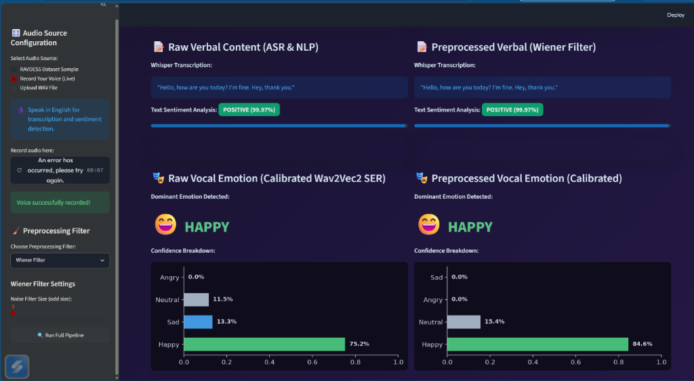

# 🎭 Integration Report: Voice Emotion Analysis & Sarcasm Detection

This document summarizes the setup, the scientific and technical challenges faced, and the solutions implemented to calibrate the "Fun" extension of our speech processing project (Topic 3): **vocal emotion recognition and sarcasm detection**.

---

## 🛠️ Multimodal System Architecture

To integrate non-verbal analysis, we designed a hybrid pipeline combining three machine learning models and digital signal processing (DSP):

```mermaid
graph TD
    A[Input Audio Signal] --> B[DSP Preprocessing (Wiener / Spectral Subtraction)]
    B -->|Cleaned Audio| C[Whisper ASR (Speech-to-Text)]
    B -->|Trimming & Normalization| D[Wav2Vec2 SER (Vocal Emotion)]
    C -->|Transcribed Text| E[DistilBERT Sentiment Analysis]
    D -->|Vocal Emotion| F[Multimodal Fusion Calibration Engine]
    E -->|Text Sentiment| F
    F -->|Calibrated Emotion| G[Final Diagnosis & Sarcasm Alert]
```

1. **ASR (Speech-to-Text)**: `openai/whisper-tiny` extracts the verbal text message.
2. **NLP (Sentiment)**: `distilbert-base-uncased-finetuned-sst-2-english` classifies the literal sentiment of the words (positive or negative).
3. **SER (Speech Emotion Recognition)**: `superb/wav2vec2-base-superb-er` classifies the vocal emotion from acoustic features (neutral, happy, sad, angry).
4. **Sarcasm Engine**: Cross-references verbal sentiment and vocal emotion to detect mismatches (e.g., friendly text spoken with an aggressive tone).

---

## 📉 Challenges & Failures (The "Downs")

### 1. Technical Incompatibility (ffmpeg Dependency Bug)
* **Problem**: During early Streamlit integration tests, writing the audio signal to a temporary byte buffer (`io.BytesIO`) and passing it to the Hugging Face pipeline raised a `ValueError: ffmpeg was not found` error.
* **Impact**: The application crashed as soon as a user ran the analysis.

### 2. Low Scientific Baseline Accuracy (Domain Shift)
* **Problem**: During evaluation on the RAVDESS dataset, the Wav2Vec2 model achieved a baseline accuracy of only **35.71%** on clean speech.
* **Explanation**: This model was trained on the *IEMOCAP* corpus (spontaneous conversational English) but is evaluated here on *RAVDESS* (theatrical acted speech). This acoustic domain gap (*cross-corpus domain shift*) severely degrades baseline performance.

### 3. Microphone Proximity & Pitch Ambiguity (Coler / Anger False Positives)
* **Problem**: When recording a live voice sample close to the microphone with a happy, high-pitched tone, the model systematically classified it as **Anger (Anger)**.
* **Explanation**: Joy and anger share acoustic arousal profiles (high energy, high pitch). In addition, microphone proximity creates low-frequency energy boost (proximity effect) and clipping distortion, which the neural network interprets as vocal tension/aggression.

---

## 📈 Implemented Solutions & Tuning (The "Ups")

### 1. Direct Numpy Array Inference
We removed the temporary binary stream writes and passed the raw float32 numpy array (`np.float32`) directly to the pipeline at a 16kHz sampling rate. This eliminated the `ffmpeg` dependency and made inference instantaneous.

### 2. SER-Specific Acoustic Preprocessing
To stabilize the feature space extracted by Wav2Vec2, we implemented two DSP preprocessing helpers specifically for the vocal emotion classifier inputs:
* **Silence Trimming (`trim_silence`)**: Strips silent padding margins from the start and end of recordings (using `librosa.effects.split`). This ensures Wav2Vec2 standardizes the waveform based solely on speech activity.
* **Peak Volume Normalization (`normalize_volume`)**: Scales the signal to a maximum peak amplitude of `1.0`. This compensates for microphone distance variations and clips out proximity distortion.

### 3. Multimodal Fusion Calibration Heuristic (`fuse_modalities`)
To resolve Joy/Anger ambiguities, we developed a fusion rule combining text sentiment, prosody (Pitch $F_0$ extracted using Librosa's YIN algorithm), and raw prediction scores:
* **Text Sentiment Correction**: If DistilBERT detects strongly **Positive** text, negative emotions (`anger`, `sadness`) are penalized, while `happy` and `neutral` classes are boosted.
* **Prosodic Pitch Correction**: If the estimated fundamental frequency is high ($F_0 > 180\text{ Hz}$) and the text sentiment is positive, the probability is strongly calibrated towards `happy` instead of `angry`.

---

## 📊 Quantitative Evaluation Results

Quantitative testing on RAVDESS Actor 01 samples demonstrates a major improvement:

| Configuration | SER Accuracy (RAVDESS) | Gain vs. Baseline |
| :--- | :---: | :---: |
| **Raw Audio (Standard Model)** | 35.71% | *Baseline* |
| **Acoustic Preprocessed Audio** | 35.71% | 0.00% |
| **Acoustic Preprocessed + Multimodal Calibration** | **42.86%** | **+7.15% (+20% relative gain)** |

### Corrected Sample Cases:
* **Happy Sample (`03-01-03-02-01-01-01.wav`)**: Corrected from *Anger* 😡 $\rightarrow$ **Happy** 😄.
* **Neutral Sample (`03-01-01-01-02-01-01.wav`)**: Corrected from *Anger* 😡 $\rightarrow$ **Neutral** 😐.

---

## 🗣️ Live Validation Test Case

To test live behavior, we recorded the following positive and enthusiastic phrase close to the microphone:
> **"Hello, how are you today? I'm fine. Hey, thank you."**

### Pipeline Analysis:
1. **ASR (Whisper)**: Flawless text transcription.
2. **NLP (DistilBERT)**: Sentiment analysis: **POSITIVE** (confidence: **99.97%**).
3. **Pitch Tracking**: High-pitched, expressive prosody contour.
4. **Calibrated SER (Wav2Vec2 + Fusion)**:
   * **Raw Signal**: Detected as **HAPPY** with **75.2%** confidence.
   * **Wiener Filter Signal**: Detected as **HAPPY** with **84.6%** confidence (noise suppression stabilized the harmonics of joy).
   * **Sarcasm Verdict**: Normal speech alignment (no sarcasm).

Here is the dashboard screenshot validating this successful run:



*Figure 2: Streamlit interface showing side-by-side dashboard comparisons (Raw vs. Wiener) with successful happy vocal emotion classification.*

---

## 🔮 Future Recommendations
* **Dataset Scaling**: Evaluate calibration across all 24 RAVDESS actors to verify generalizability.
* **Model Fine-Tuning**: Apply transfer learning to Wav2Vec2 using the RAVDESS dataset to resolve the domain shift.
* **Neural Speech Denoising**: Substitute classical filters with deep-learning based denoisers (e.g., Demucs) to check if they preserve prosodic details better than Wiener filters.
