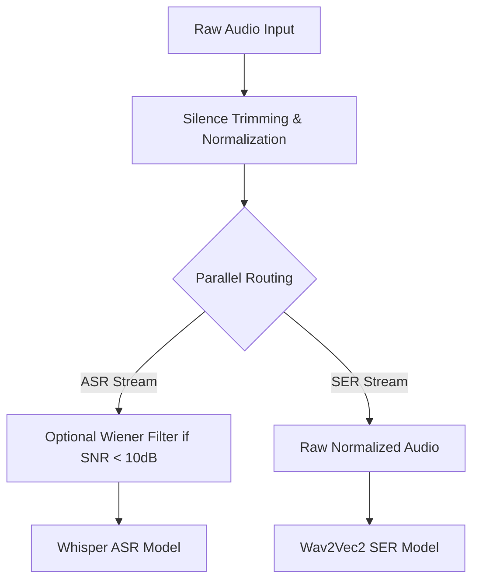

# Role 2: Audio Preprocessing Engineer - Video Script
*Duration: ~2 minutes*

> **Note to Presenters (Bilel & Elio):** This is a two-person presentation. Bilel will cover the DSP architecture and limits, and Elio will cover the parallel routing and VAD/Feature extraction.

---

### [Slide 1: Title - Audio Preprocessing & DSP Architecture]
`[VISUAL: visuals/slide_r2_title.png — Title slide: Audio Preprocessing & DSP Architecture]`

**Bilel (Voiceover):**
"Moving to the foundational layer of the pipeline, signal conditioning is critical for both speech recognition and emotion detection. 
The objective here was to systematically evaluate classical Digital Signal Processing techniques to prepare raw audio before it reaches the deep learning models. 
Drawing on foundational research by Oppenheim and Lim on the importance of phase and amplitude, our system evaluates two traditional denoising algorithms: the Wiener Filter and Spectral Subtraction."

---

### [Slide 2: The Limits of Classical DSP]
`[VISUAL: visuals/slide_r2_limits.png — Limits of Classical DSP: Spectral Subtraction vs. Wiener Filter]`

**Bilel (Voiceover):**
"Empirical evaluation revealed significant limitations in classical DSP when applied to complex, real-world noise.
While the Wiener Filter successfully improved the Word Error Rate for stationary white Gaussian noise, it proved detrimental in non-stationary conditions. 
More importantly, as detailed by Evans et al., Spectral Subtraction introduces fundamental artifacts like 'musical noise'. Our experiments confirmed this: modern attention mechanisms in models like Whisper hallucinate these artifacts as phonemes, degrading transcription accuracy by up to 27 percent. We maintain these negative results as a documented baseline to prove why magnitude-only subtraction fails for transformer-based ASR."

---

### [Slide 3: Parallel Stream Routing Architecture]
`[VISUAL: visuals/slide_parallel_routing.png — Block diagram of the Parallel Routing Architecture]`

Here is the schema of the decoupled pipeline:

**Elio (Voiceover):**
"A secondary, critical finding was that classical denoising destroys the prosodic micro-features—such as pitch, jitter, and shimmer—that are absolutely essential for Speech Emotion Recognition. Filtering dropped emotion classification accuracy by over 21 percent.
To resolve this multimodal conflict, we engineered a Parallel Stream Routing Architecture. 
We route the optionally denoised audio exclusively to the ASR stream. Meanwhile, the Wav2Vec2 emotion model receives raw audio that has only undergone our custom Voice Activity Detection, silence trimming, and peak normalization. 
By decoupling these streams and extracting acoustic features like YIN pitch and SNR independently, we preserve the vital emotional nuances while still isolating static noise for transcription."
